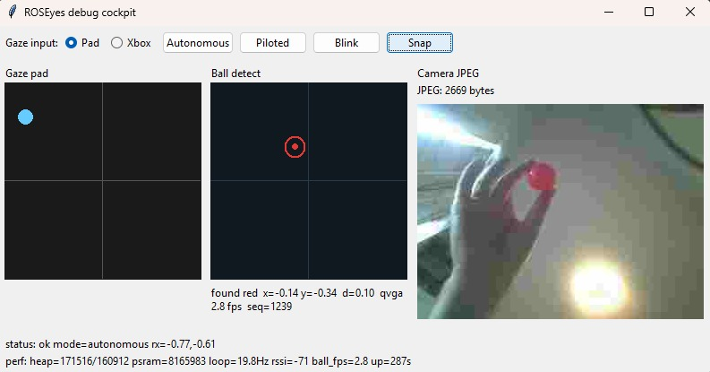
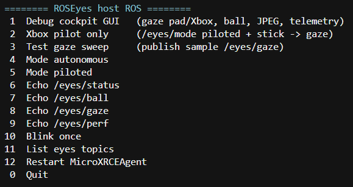

# ROSEyes

ROS 2–compatible dual “eye” displays for mobile robots, driven by a **Seeed XIAO ESP32-S3 Sense** and controlled over **micro-ROS (WiFi / UDP)**.

Default behavior: cartoon eyes with a gentle idle gaze and a semi-random blink every 2–3 seconds.  
Remote control: publish normalized gaze on `/eyes/gaze` (`geometry_msgs/Vector3`, `x`/`y` in **[-1, 1]**).

| Piece | Product |
|-------|---------|
| MCU | [XIAO ESP32-S3 Sense](https://www.seeedstudio.com/XIAO-ESP32S3-Sense-p-5639.html) |
| Base | [Grove Base for XIAO](https://www.seeedstudio.com/Grove-Shield-for-Seeeduino-XIAO-p-4621.html) |
| Displays | [Spotpear Electronic EYE 0.71″ dual LCD (GC9D01)](https://spotpear.com/shop/Raspberry-Pi-ESP32-Pico-Arduino-STM32-51-0.71-inch-Round-LCD-EYE-Double.html) |
| Range (future) | [Waveshare TOF Laser Range Sensor Mini](https://www.waveshare.com/tof-laser-range-sensor-mini.htm) |

Architecture details: [docs/ARCHITECTURE.md](docs/ARCHITECTURE.md)  
ROS topics + examples: [docs/ROS_TOPICS.md](docs/ROS_TOPICS.md)  
Onboard camera tracking: [docs/CAMERA_BALL_TRACKING.md](docs/CAMERA_BALL_TRACKING.md)  
Agent / contributor guide: [AGENTS.md](AGENTS.md)

---

## Features

- Dual 160×160 GC9D01 SPI eyes (modular C++ firmware, PlatformIO)
- Idle animation + blink without any ROS traffic
- micro-ROS over WiFi (client **jazzy**, agent = native Windows **MicroXRCEAgent**)
- WiFi / agent credentials seeded at flash time from env vars into **ESP32 NVS**
- Host tools: PowerShell scripts, Xbox → ROS publisher (pygame + Windows ROS)
- Native unit tests + source guardrails (1 class / file, size, docs)
- Debug cockpit (Tk): gaze pad / Xbox, ball view, JPEG snap, `/eyes/perf`

TOF I2C is wired and stubbed (`TofRangeSensorStub`) but **not** driven yet.

<p align="center">
  
</p>
<p align="center"><em>Debug cockpit — ball lock + on-demand JPEG snap</em></p>

<p align="center">
  
</p>
<p align="center"><em>Host menu (<code>Start-RosEyes.ps1</code>) — launches ROS, agent, and the cockpit</em></p>

---

## Repository layout

```
firmware/     PlatformIO project (XIAO + native tests)
scripts/      PowerShell helpers (ROS, flash, tests, agent)
python/       Xbox / test gaze publishers
docker/       Legacy micro-ROS agent compose (optional; not required)
docs/         Architecture, ROS topics, camera tracking
tests/        Guardrail scripts
```

---

## Hardware wiring

### Eyes (SPI)

| Signal | XIAO | GPIO |
|--------|------|------|
| RST1 | D0 | 1 |
| RST2 | D1 | 2 |
| CS1 | D2 | 3 |
| CS2 | D3 | 4 |
| CLK | D8 | 7 |
| DC | D9 | 8 |
| SDA (MOSI) | D10 | 9 |
| 3V3 | 3V3 | — |
| GND | GND | — |

If panels stay black after a successful flash, tie **BL1/BL2** (backlight) to **3V3** (module-dependent).

### TOF (I2C, reserved)

| Signal | XIAO | GPIO |
|--------|------|------|
| SDA | D4 | 5 |
| SCL | D5 | 6 |
| 5V | 5V | — |
| GND | GND | — |

---

## Prerequisites

1. **Python 3** with [PlatformIO](https://platformio.org/): `pip install platformio`
2. **ROS 2** on Windows with **`ROS2_WINDOWS_SETUP`** set to your `setup.ps1`
3. **Visual Studio** (C++ workload) + **CMake** — to build native `MicroXRCEAgent` once
4. **WSL2** (required only for the full micro-ROS firmware env — bash/colcon)
5. Environment variables:
   - `WIFI_SSID` / `WIFI_PASS` (for micro-ROS / OTA flash seeding)
   - `MICROROS_AGENT_IP` (PC LAN IP reachable from the ESP; auto-detected if unset)
   - optional `MICROROS_AGENT_PORT` (default `8888`)
   - **`ROS2_WINDOWS_SETUP`** — absolute path to your ROS 2 `setup.ps1`
   - optional `MICROROS_AGENT_HOME` / `MICROROS_AGENT_EXE` — override agent install location

Docker Desktop is **not** required anymore.

---

## Quick start

### 1. Unit tests + guardrails

```powershell
cd I:\GIT\ROSEyes
powershell -ExecutionPolicy Bypass -File .\scripts\Run-Tests.ps1
```

### 2. Install + start micro-ROS agent (Windows native, once)

```powershell
# First time only (VS + CMake; downloads Fast DDS deps):
.\scripts\Install-MicroRosAgent.ps1

# Every session:
.\scripts\Start-MicroRosAgent.ps1
```

Runs `MicroXRCEAgent udp4 --port 8888` (native Windows; no Docker).

### 3. Flash the ESP (COM16 by default)

**Eyes-only (Windows-native, recommended first bring-up):**

```powershell
.\scripts\List-SerialPorts.ps1
.\scripts\Build-And-Upload.ps1 -Port COM16
.\scripts\Build-And-Upload.ps1 -OtaIp 192.168.x.x
```

**Full micro-ROS (requires WSL2 — `micro_ros_platformio` needs bash/colcon):**

```powershell
.\scripts\Build-And-Upload-Wsl.ps1 -Port COM16
.\scripts\Build-And-Upload-Wsl.ps1 -OtaIp 192.168.x.x
```

### 4. Publish a test gaze (host ROS)

First time (or after `python/requirements.txt` changes):

```powershell
.\scripts\0_setup_python_env.ps1
```

Then:

```powershell
.\scripts\Start-MicroRosAgent.ps1
.\scripts\Test-Ros.ps1

# Fixed pose:
.\scripts\Test-Ros.ps1 -FixedGaze -GazeX 0.8 -GazeY -0.4
```

Watch the panels: sweep looks left → right → center. Confirm with:

```powershell
. .\scripts\Activate-Ros.ps1
ros2 topic echo /eyes/status --once
```

### 5. Host ROS menu (debug cockpit, Xbox, mode, echoes)

```powershell
.\scripts\Start-RosEyes.ps1
```

Menu **1** opens the Tk debug cockpit (gaze pad / Xbox, ball detect view, JPEG snap, status/perf). Or Xbox only: `.\scripts\Start-XboxGaze.ps1`. Left stick = gaze, **A** = blink.

Serial: after OTA, reopen monitor and press reset so CDC prints `hb ...` / `gaze ...`.

---

## ROS topics

Full contracts + copy-paste examples: [docs/ROS_TOPICS.md](docs/ROS_TOPICS.md).

| Topic | Type | Direction | Meaning |
|-------|------|-----------|---------|
| `eyes/gaze` | `geometry_msgs/msg/Vector3` | host → ESP | `x`/`y` in [-1, 1] (look right / down) |
| `eyes/blink` | `std_msgs/msg/Empty` | host → ESP | force one blink |
| `eyes/mode` | `std_msgs/msg/String` | host → ESP | `autonomous` \| `piloted` |
| `eyes/status` | `std_msgs/msg/String` | ESP → host | heartbeat / debug |
| `eyes/ball` | `std_msgs/msg/String` | ESP → host | ball telemetry JSON (camera builds) |
| `eyes/perf` | `std_msgs/msg/String` | ESP → host | heap / loop / WiFi / ball fps JSON |
| `eyes/camera/snap` | `std_msgs/msg/Empty` | host → ESP | request one JPEG |
| `eyes/camera/jpeg` | `std_msgs/msg/UInt8MultiArray` | ESP → host | JPEG bytes (on-demand) |

Gaze / ball freshness: ~2.5 s without updates → idle saccades.

---

## License

MIT — see [LICENSE](LICENSE).
