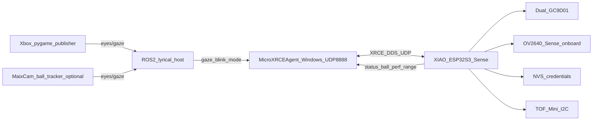
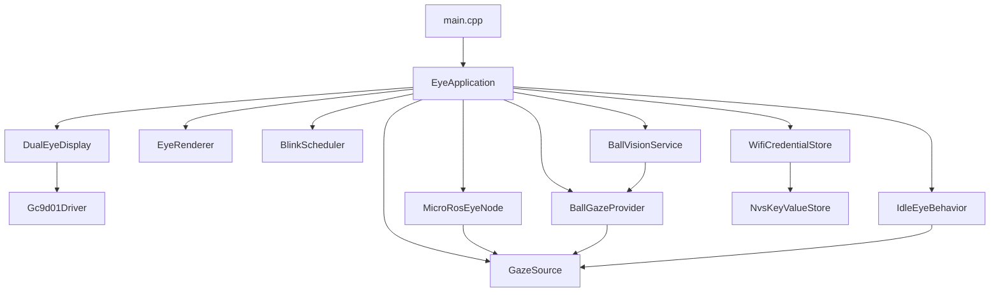
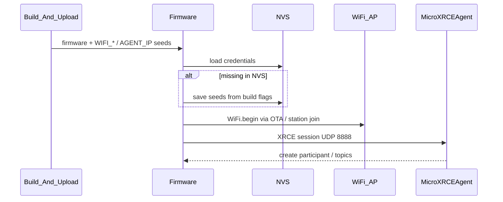

# ROSEyes architecture

## System context

Onboard camera tracking (dual-core, mode, gaze mux): **[CAMERA_BALL_TRACKING.md](CAMERA_BALL_TRACKING.md)**  
Topic contracts and host examples: **[ROS_TOPICS.md](ROS_TOPICS.md)**

## Firmware modules

Two PlatformIO device envs:

- `xiao_esp32s3_eyes_only` — display + idle/blink; builds on native Windows
- `xiao_esp32s3` — adds micro-ROS WiFi client; **must be built under WSL2** because `micro_ros_platformio` invokes bash/`colcon` to compile `libmicroros`

### Responsibility split

| Module | Responsibility |
|--------|----------------|
| `Gc9d01Driver` | Panel init + SPI command/data |
| `DualEyeDisplay` | Two CS/RST panels, fill primitives |
| `EyeRenderer` | Cartoon eye drawing / blink frame |
| `GazeState` | Normalized [-1,1] ↔ pixel offsets |
| `GazeSource` | Mux of `IFreshGazeProvider`s + idle fallback |
| `BlinkScheduler` | Random 2–3 s blink timing |
| `IdleEyeBehavior` | Random 2D saccades + fixations when no fresh provider |
| `WifiCredentialStore` | NVS load/seed/save (`loadOrSeed`) |
| `MicroRosEyeNode` | WiFi XRCE; spin before eyes, reconnect after; status/ball/perf/range/jpeg |
| `BallVisionService` | OV2640 + FreeRTOS core1 detect → `BallObservation` |
| `BallGazeProvider` | Observation → `IFreshGazeProvider` (same contract as ROS gaze) |
| `EyeApplication` | Orchestration + dirty-state rendering + frame-budget pacing |
| `TofRangeSensor` | Waveshare TOF Mini I2C → `RangeObservation` / `/eyes/range` |

Design rules: **1 class = 1 header/source pair**, files **&lt; 400 lines**, **&lt; 30 public methods**, documented public APIs. Enforced by `tests/guardrails/run_guardrails.py`.

## Boot / credential flow

## ROS contracts (summary)

Full tables and copy-paste examples: [ROS_TOPICS.md](ROS_TOPICS.md).

| Topic | Type | Direction |
|-------|------|-----------|
| `eyes/gaze` | `geometry_msgs/msg/Vector3` | host → ESP |
| `eyes/blink` | `std_msgs/msg/Empty` | host → ESP |
| `eyes/mode` | `std_msgs/msg/String` (`autonomous` \| `piloted`) | host → ESP |
| `eyes/status` | `std_msgs/msg/String` | ESP → host |
| `eyes/ball` | `std_msgs/msg/String` (JSON telemetry) | ESP → host |

Freshness window for gaze / ball lock: **~2.5 s**, then idle saccades.

micro-ROS client distro: **jazzy**. Host: `$env:ROS2_WINDOWS_SETUP` → `Activate-Ros.ps1`.

## Future work

1. Camera ROI search / sticky color lock refinements (see camera doc).
2. Optional emotion / animation bank from Spotpear demos if RAM allows.
