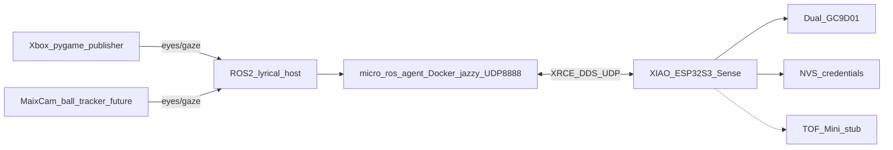
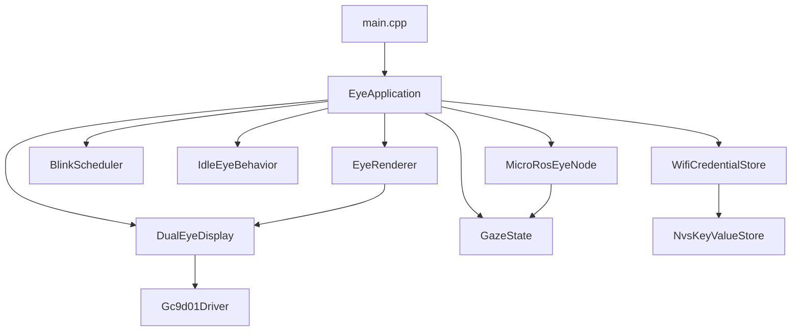

# ROSEyes architecture

## System context

## Firmware modules

Two PlatformIO device envs:

- `xiao_esp32s3_eyes_only` — display + idle/blink; builds on native Windows
- `xiao_esp32s3` — adds micro-ROS WiFi client; **must be built under WSL2** because `micro_ros_platformio` invokes bash/`colcon` to compile `libmicroros`

### Responsibility split

| Module | Responsibility |
|--------|----------------|
| `Gc9d01Driver` | Panel init + SPI command/data |
| `DualEyeDisplay` | Two CS/RST panels, fill primitives |
| `EyeRenderer` | Cartoon eye drawing / blink frame |
| `GazeState` | Normalized [-1,1] ↔ pixel offsets |
| `BlinkScheduler` | Random 2–3 s blink timing |
| `IdleEyeBehavior` | Slow left/right idle when ROS silent |
| `WifiCredentialStore` | NVS load/seed/save (`loadOrSeed`) |
| `MicroRosEyeNode` | WiFi transport, sub/pub, atomic entity lifecycle |
| `EyeApplication` | Orchestration + dirty-state rendering |
| `TofRangeSensorStub` | Reserved API for later I2C TOF |

Design rules: **1 class = 1 header/source pair**, files **&lt; 400 lines**, **&lt; 30 public methods**, documented public APIs. Enforced by `tests/guardrails/run_guardrails.py`.

## Boot / credential flow

## ROS contracts

- **`eyes/gaze`** (`geometry_msgs/msg/Vector3`)
  - `x`: look left (−1) … right (+1)
  - `y`: look up (−1) … down (+1) in display space (Xbox publisher inverts stick Y by default)
  - `z`: unused (0)
  - Freshness window: 500 ms
- **`eyes/blink`** (`std_msgs/msg/Empty`): one-shot blink request
- **`eyes/status`** (`std_msgs/msg/String`): ~1 Hz heartbeat

micro-ROS client distro: **jazzy** (`board_microros_distro`).  
Host tools on this workspace target **ROS 2 lyrical** (`I:\ROS\ros2-windows`).

## Future work

1. Implement `TofRangeSensorStub` → real Waveshare TOF Mini I2C driver; optionally publish `/eyes/range`.
2. MaixCam ball tracker publishes `/eyes/gaze` on the robot ROS graph.
3. Optional emotion / animation bank from Spotpear demos if RAM allows.
4. Camera on XIAO Sense (not used in v1).
