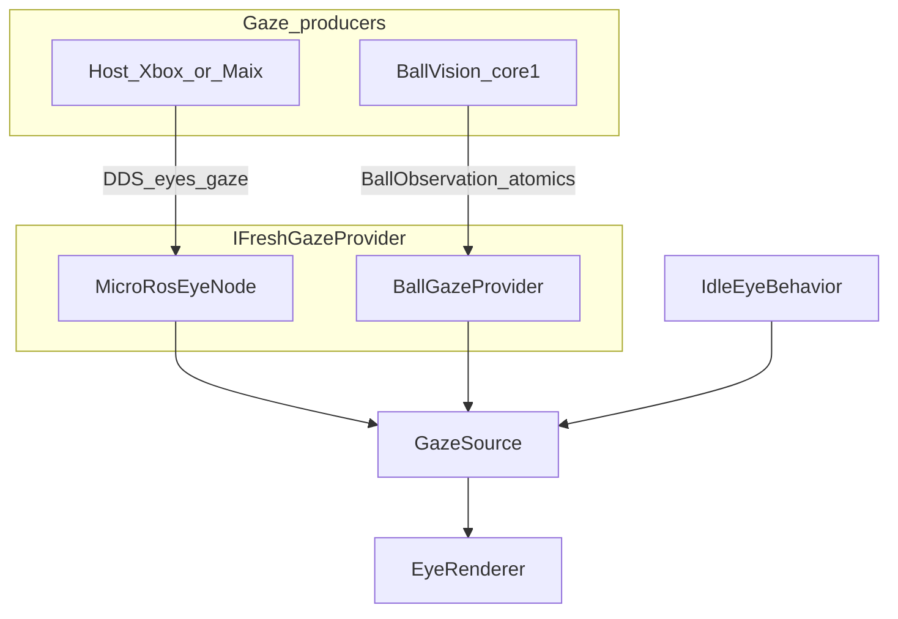
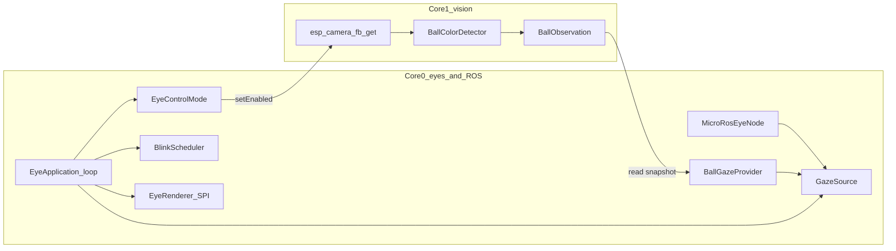
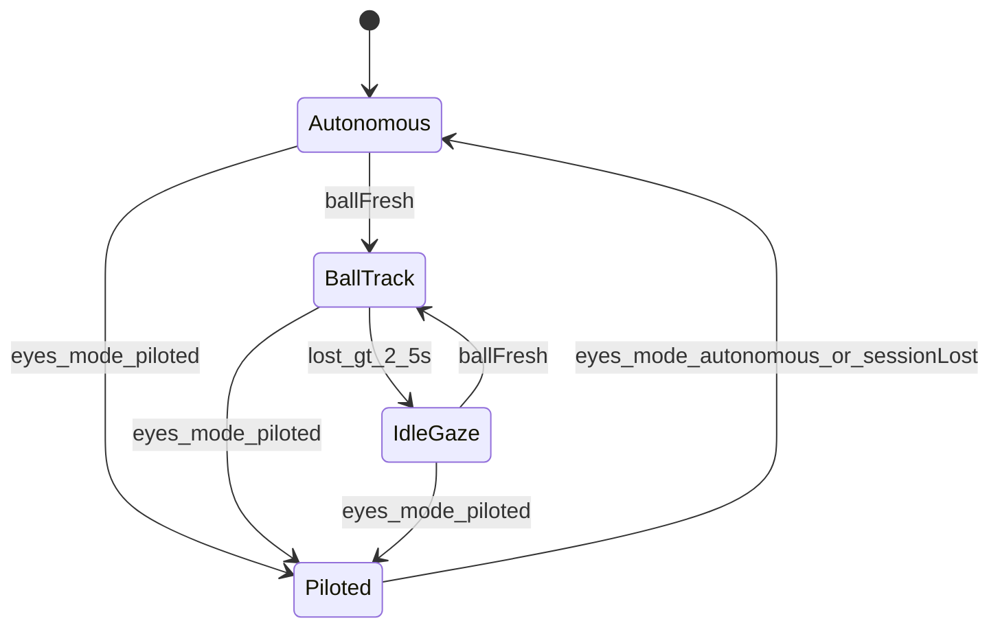

# Camera ball tracking (onboard)

How the XIAO ESP32-S3 Sense camera drives eye gaze **without** tightly coupling the vision pipeline to the renderer.

Canonical product plan: ROS topic details and host examples: [ROS_TOPICS.md](ROS_TOPICS.md).

## Goal

- Track a colored ball (**red**, then **green** fallback) with the Sense OV2640.
- Move the dual GC9D01 eyes toward the ball while **Autonomous**.
- Leave eye control to host `/eyes/gaze` while **Piloted** (camera off).
- Fall back to idle saccades when nothing is fresh (~2.5 s).

## Design principle: one gaze path

Xbox, a future MaixCam tracker, and the onboard camera all produce the **same kind of thing**: a fresh normalized gaze in [-1, 1].

| Producer           | How it enters firmware                                                          |
| ------------------ | ------------------------------------------------------------------------------- |
| Host / Xbox / Maix | DDS `/eyes/gaze` → `MicroRosEyeNode` (`IFreshGazeProvider`)                     |
| Onboard camera     | Core1 → `BallObservation` (atomics) → `BallGazeProvider` (`IFreshGazeProvider`) |
| Silence            | `IdleEyeBehavior`                                                               |

We do **not** publish onboard detections back through MicroXRCEAgent just to subscribe them again: that would require the agent online in Autonomous mode and add latency. The **contract** matches ROS gaze; the **transport** stays on-chip via a shared snapshot.

`GazeSource` priority:

1. **Piloted** + fresh ROS gaze → ROS
2. **Autonomous** + fresh ball gaze → ball
3. Else → idle (and reset idle phase when leaving an external source)

## Dual-core split

| Core  | Owns                                                                  | Does not own           |
| ----- | --------------------------------------------------------------------- | ---------------------- |
| **0** | SPI eyes, blink, micro-ROS spin, mode, gaze mux, `/eyes/ball` publish | Pixel scan             |
| **1** | Camera grab + detect + write observation                              | Renderer, ROS entities |

Handoff is a POD snapshot (`found`, `x`, `y`, `diameter`, `timestamp_ms`, `seq`, `framesize`, `color`) with a sequence counter so core0 can ignore torn reads if needed (double-buffer or seq-before/after).

## Control modes

| Mode         | Set by                                                | Camera | Gaze preference                  |
| ------------ | ----------------------------------------------------- | ------ | -------------------------------- |
| `autonomous` | Boot default, `/eyes/mode`, or micro-ROS session lost | ON     | Ball if fresh, else idle         |
| `piloted`    | `/eyes/mode` while session OK                         | OFF    | `/eyes/gaze` if fresh, else idle |

Blink always stays local (`BlinkScheduler` + optional `/eyes/blink`).

## Detection

- **Sensor:** OV2640 via `esp_camera`, RGB565 in PSRAM.
- **Framesize:** fixed **QVGA 320×240** by default (`BallVisionConfig::kEnableDynamicQqvga = false`). Set that flag to `true` to re-enable near-ball **QQVGA** hysteresis. Measure FPS on-device with WiFi + micro-ROS running.
- **Color:** saturated RGB565 masks — **sticky preferred color first**, then the other (`kEnableGreenFallback`). Yellow/warm lamps are rejected via G/R caps.
- **Blobs:** connected components on the stepped grid; score picks the most compact blob and rejects oversized ones (`kMaxDiameter`).
- **Shape:** area / min size / aspect / fill — thresholds adapt to frame width when QQVGA is on.
- **Scan step:** QVGA every pixel; QQVGA every 2nd pixel.
- **Mapping:** blob center → gaze `x,y` in [-1, 1] (image center = 0); small deadzone to kill jitter.

### Why not YOLO on this ESP?

The XIAO ESP32-S3 Sense has **no NPU**. Tiny quantized detectors (ESP-DL / YOLO-Fastest class) can sometimes crawl at low FPS on small inputs, but classic YOLO (v5/v8/…) is not realistic next to dual SPI eyes + WiFi XRCE. For a solid-colored ball, a **cheap RGB blob** is the right tool on-chip; run real YOLO on MaixCAM2 (or a host GPU) and publish `/eyes/gaze` in **piloted** mode.

### Why not only 160×120?

Doubling linear resolution (~4× pixels) helps when the ball is **far**. Near the camera, QQVGA frees CPU — optional via `kEnableDynamicQqvga` (off by default once QVGA alone is ~8–9 fps).

## Dynamic QQVGA (optional)

Prefer **sensor framesize** changes over CPU decimation when enabled (`kEnableDynamicQqvga`):

| Tier | Typical size | Use when                                |
| ---- | ------------ | --------------------------------------- |
| High | 320×240      | Searching / small diameter / after lost |
| Mid  | 160×120      | Near / large diameter                   |

## ROI search (planned)

After a lock:

1. Search a window around the last center, radius ≈ `2..3 × last_diameter` (clamped to the frame).
2. On miss → one full-frame pass (same or next tick).

Not “half the image” arbitrarily — scale the ROI with the last blob size.

**Padding / alignment:** our ROI is a **software** window over an already-captured RGB565 framebuffer — only rule is clamp to `[0..width) × [0..height)`. Prefer even `x` / width when iterating RGB565 pairs. No OV2640 JPEG MCU padding applies unless we later use **hardware** sensor windowing (`set_res_raw` / crop); those APIs often want start/size multiples of 8 or 16 — we are not using that yet.

## Green fallback

Second RGB565 mask after the preferred color misses. Priority: **last valid color
first** (sticky across misses), then the other color, then idle after 2.5 s.
Cold start prefers red. Sticky/ROI spatial lock is still planned.

## Telemetry

Core0 publishes `/eyes/ball` with center, normalized diameter, detection FPS, framesize, and color (see [ROS_TOPICS.md](ROS_TOPICS.md)). Cheap compared to SPI eye updates.

**Debug JPEG:** host publishes Empty on `/eyes/camera/snap`; core1 encodes one JPEG into `CameraJpegMailbox`; core0 publishes `/eyes/camera/jpeg` (`UInt8MultiArray`). Use menu item **1** (debug cockpit) — not a continuous stream.

**Detection notes:** RGB565 byte-swap on; fast RGB red/green masks (no HSV); fill-ratio filter; xclk 16 MHz / fb_count 2. Shared gaze Y is camera/ROS convention (+down); `EyeMountPolicy` flips Y for the rotated panels.

## Feature flag

`ROSEYES_ENABLE_CAMERA_BALL` — on for Sense device envs; off for `native` unit tests (detector tested on synthetic buffers only).