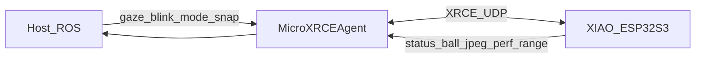

# ROSEyes ROS topics

Host ↔ ESP contracts for gaze, blink, mode, status, and ball telemetry.  
Activate host ROS with `ROS2_WINDOWS_SETUP`, then either:

```powershell
.\scripts\Start-RosEyes.ps1          # interactive menu (Xbox, mode, echoes)
.\scripts\Activate-Ros.ps1           # manual ros2 CLI
```

Agent: `.\scripts\Start-MicroRosAgent.ps1` (also started by the menu unless `-SkipAgentStart`).

Architecture of onboard camera vs ROS: [CAMERA_BALL_TRACKING.md](CAMERA_BALL_TRACKING.md).

## Topic map

| Topic | Type | Direction | Role |
|-------|------|-----------|------|
| `/eyes/gaze` | `geometry_msgs/msg/Vector3` | host → ESP | Normalized look direction |
| `/eyes/blink` | `std_msgs/msg/Empty` | host → ESP | Force one blink |
| `/eyes/mode` | `std_msgs/msg/String` | host → ESP | `autonomous` \| `piloted` |
| `/eyes/status` | `std_msgs/msg/String` | ESP → host | Heartbeat / debug |
| `/eyes/ball` | `std_msgs/msg/String` | ESP → host | Ball detection telemetry (JSON text) |
| `/eyes/perf` | `std_msgs/msg/String` | ESP → host | Heap / loop / WiFi / ball fps (JSON) |
| `/eyes/range` | `std_msgs/msg/String` | ESP → host | TOF Mini distance (JSON, ~10 Hz) |
| `/eyes/camera/snap` | `std_msgs/msg/Empty` | host → ESP | Request one JPEG snapshot |
| `/eyes/camera/jpeg` | `std_msgs/msg/UInt8MultiArray` | ESP → host | JPEG bytes (on-demand) |

All names are relative to the micro-ROS node namespace (typically bare `eyes/...` on the agent graph; use `ros2 topic list` to confirm).



---

## `/eyes/gaze`

**Type:** `geometry_msgs/msg/Vector3`

| Field | Meaning |
|-------|---------|
| `x` | −1 look left … +1 look right |
| `y` | −1 look up … +1 look down (shared/ROS/camera; panel mount flips Y in firmware) |
| `z` | unused (publish `0`) |

**Freshness:** if no sample for ~**2.5 s**, ESP falls back to idle saccades (same window as ball lock loss).

**Who publishes:** Xbox (`Start-XboxGaze.ps1`), `Test-Ros.ps1` / `publish_test_gaze.py`, or any host node (e.g. MaixCam tracker). Onboard camera does **not** loop this topic; it feeds an on-chip `IFreshGazeProvider` with the same semantics.

### Examples

Sweep / sample burst:

```powershell
.\scripts\Test-Ros.ps1
.\scripts\Test-Ros.ps1 -FixedGaze -GazeX 0.8 -GazeY -0.4 -Count 20
```

Manual one-shot (after `Activate-Ros.ps1`):

```powershell
ros2 topic pub --once /eyes/gaze geometry_msgs/msg/Vector3 "{x: 0.7, y: -0.3, z: 0.0}"
```

Hold a pose (rate-limited):

```powershell
ros2 topic pub -r 10 /eyes/gaze geometry_msgs/msg/Vector3 "{x: 0.0, y: 0.5, z: 0.0}"
```

Xbox:

```powershell
.\scripts\Start-XboxGaze.ps1
```

---

## `/eyes/blink`

**Type:** `std_msgs/msg/Empty`

```powershell
ros2 topic pub --once /eyes/blink std_msgs/msg/Empty "{}"
```

Xbox **A** button publishes the same from `xbox_gaze_publisher.py`.

---

## `/eyes/mode`

**Type:** `std_msgs/msg/String` — `data` is a lowercase token.

| `data` | Camera | Gaze preference |
|--------|--------|-----------------|
| `autonomous` | ON (when camera feature built-in) | Ball if fresh, else idle |
| `piloted` | OFF | `/eyes/gaze` if fresh, else idle |

**Defaults:** boot → `autonomous`. If the micro-ROS session drops, firmware forces `autonomous` so eyes keep working offline.

### Examples — switch modes

Pilot with Xbox / host gaze (camera stops):

```powershell
ros2 topic pub --once /eyes/mode std_msgs/msg/String "{data: piloted}"
.\scripts\Start-XboxGaze.ps1
```

Back to onboard tracking (when camera firmware is flashed):

```powershell
# Stop Xbox publisher (Ctrl+C), then:
ros2 topic pub --once /eyes/mode std_msgs/msg/String "{data: autonomous}"
```

Keep publishing mode at low rate if you want a sticky host preference while the agent is up:

```powershell
ros2 topic pub -r 1 /eyes/mode std_msgs/msg/String "{data: piloted}"
```

---

## `/eyes/status`

**Type:** `std_msgs/msg/String` — human-readable heartbeat from the ESP (~0.5 Hz).

```powershell
ros2 topic echo /eyes/status
```

Expect a short debug string such as `ok mode=autonomous gaze=0.12,-0.05`.
`gaze=` is the **active muxed** eye pose (ROS / ball / idle), not only the last
host `/eyes/gaze` sample. Exact format may evolve; treat as debug, not a hard API.

---

## `/eyes/ball`

**Type:** `std_msgs/msg/String` — JSON payload (stable keys below). Published when camera tracking is enabled.

| Key | Type | Meaning |
|-----|------|---------|
| `found` | bool | Ball detected this sample |
| `x`, `y` | float | Center normalized [-1, 1] (same axes as `/eyes/gaze`) |
| `diameter` | float | Blob diameter / image width, ≈ [0, 1] |
| `fps` | float | Recent detection rate |
| `framesize` | string | e.g. `qvga`, `qqvga`, `qqqvga` |
| `color` | string | `red` \| `green` \| `none` |
| `seq` | int | Monotonic observation sequence |

Example payload:

```json
{"found":true,"x":0.22,"y":-0.10,"diameter":0.18,"fps":11.5,"framesize":"qvga","color":"red","seq":1042}
```

```powershell
ros2 topic echo /eyes/ball
```

When `found` is false for ~2.5 s, gaze mux falls back to idle (Autonomous). Hosts can use `diameter` + `framesize` to debug dyn-res later.

---

## `/eyes/perf`

**Type:** `std_msgs/msg/String` — JSON ~1 Hz (micro-ROS builds).

| Key | Meaning |
|-----|---------|
| `heap_free` / `heap_size` / `heap_pct` | Internal RAM free / total / % free |
| `heap_min` | Lowest free heap since boot |
| `psram_free` / `psram_size` / `psram_pct` | PSRAM free / total / % free (Sense ≈ 8 MiB) |
| `cpu0_pct` / `cpu1_pct` | Approx busy % per core (idle-hook estimate) |
| `loop_hz` | Main loop rate estimate |
| `wifi_rssi` | RSSI dBm (0 if WiFi down) |
| `ball_fps` | Vision detection rate |
| `uptime_s` | Seconds since boot |

```powershell
ros2 topic echo /eyes/perf
# or Start-RosEyes.ps1 → 1 Debug cockpit / 9 Echo perf
```

---

## `/eyes/range`

**Type:** `std_msgs/msg/String` — JSON ~10 Hz when the Waveshare TOF Mini ACKs on I2C.

| Key | Meaning |
|-----|---------|
| `mm` | Distance in millimeters (register 0x24) |
| `ok` | `true` when distance is in Mini span (~20–8000 mm); `dis_status` alone is not authoritative on this module |
| `status` | Sensor `dis_status` (often `1` while ranging is still good) |
| `strength` | Signal strength |
| `seq` | Monotonic sample counter |

```powershell
ros2 topic echo /eyes/range
# or Start-RosEyes.ps1 → 1 Debug cockpit (footer line)
```

Pins: SDA=GPIO5 (D4), SCL=GPIO6 (D5) on **Wire1** (separate from the camera SCCB bus). If the sensor is absent, boot logs `TOF Mini not detected`.

---

## `/eyes/camera/snap` → `/eyes/camera/jpeg`

On-demand debug snapshot (not a video stream). ESP encodes one QVGA JPEG when it receives Empty on snap, then publishes raw bytes on jpeg.

| Topic | Type | Direction |
|-------|------|-----------|
| `/eyes/camera/snap` | `std_msgs/msg/Empty` | host → ESP |
| `/eyes/camera/jpeg` | `std_msgs/msg/UInt8MultiArray` | ESP → host (`data` = JPEG file bytes) |

```powershell
.\scripts\Start-RosEyes.ps1   # menu → 1 Debug cockpit (Snap + ball + gaze)
# or after Activate-Ros.ps1:
python\roseyes_debug_ui.py
```

Requires camera firmware (`ROSEYES_ENABLE_CAMERA_BALL`), WiFi, and agent session Ready. Max payload ~12 KiB.

---

## Typical sessions

### A. Bring-up without camera

```powershell
.\scripts\Start-MicroRosAgent.ps1
.\scripts\Test-Ros.ps1
ros2 topic echo /eyes/status --once
```

### B. Piloted Xbox

```powershell
ros2 topic pub --once /eyes/mode std_msgs/msg/String "{data: piloted}"
.\scripts\Start-XboxGaze.ps1
```

### C. Autonomous ball (after camera firmware)

```powershell
ros2 topic pub --once /eyes/mode std_msgs/msg/String "{data: autonomous}"
ros2 topic echo /eyes/ball
```

### D. Camera snap / debug cockpit

```powershell
.\scripts\Start-RosEyes.ps1
# choose 1 — Debug cockpit (pad/Xbox, ball view, Snap JPEG, perf)
```

### E. External tracker (Maix) as pilot source

Publish ball-derived gaze on **`/eyes/gaze`** and set **`piloted`** (or leave Autonomous off-board tracker competing — prefer **piloted** so the Sense camera stays off):

```powershell
ros2 topic pub --once /eyes/mode std_msgs/msg/String "{data: piloted}"
# Maix (or other) node publishes Vector3 on /eyes/gaze
```

---

## Env reminders

| Variable | Purpose |
|----------|---------|
| `ROS2_WINDOWS_SETUP` | Path to host ROS `setup.ps1` |
| `MICROROS_AGENT_IP` | LAN IP seeded into ESP NVS (must reach the PC agent) |
| `MICROROS_AGENT_EXE` / `MICROROS_AGENT_HOME` | Native MicroXRCEAgent location |
| `WIFI_SSID` / `WIFI_PASS` | Flash-time WiFi seed |

Docker agent is **not** required; see README.
